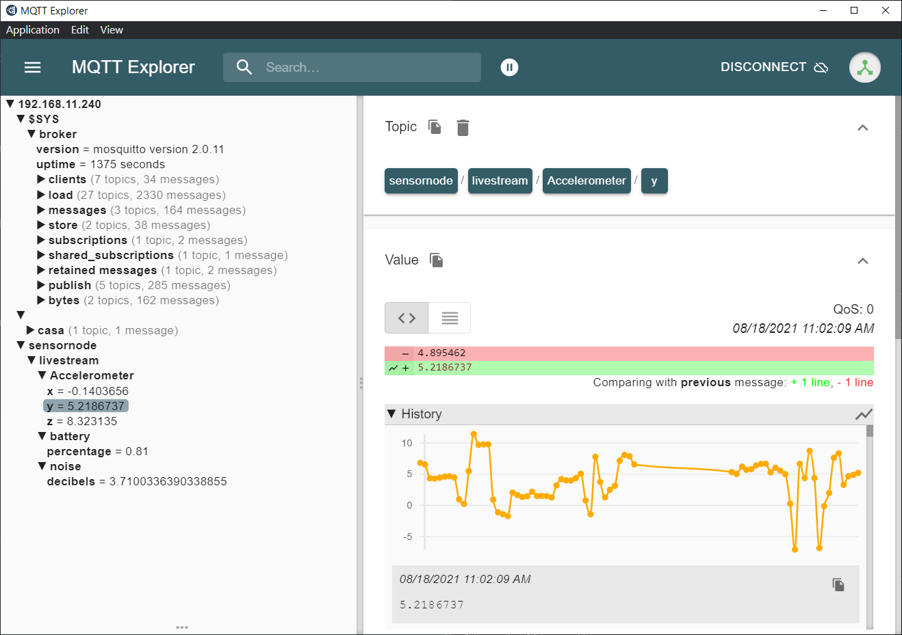

# OpenWrt MQTT

Reutilizando routers con firmware OpenWrt. Agradezco a https://github.com/igr91/ por compilar una versión mínima de OpenWrt para un TL-WR941ND V5.1 con sólo 4MB de ROM y 32MB de RAM. Luego de brickear el dispositivo descubrimos que se podía cambiar el target a un TL-WR841ND V8 el cual permite usar ath79 y estar al dia con el kernel.

````
root@OpenWrt:~# uname -a
Linux OpenWrt 5.4.140 #0 Tue Aug 17 16:41:17 2021 mips GNU/Linux
````

los paquetes incluidos en este release son:


````

base-files - 1449-r17345-efca67983d
busybox - 1.33.1-11
cJSON - 1.7.14-3
ca-bundle - 20210119-1
collectd - 5.12.0-11
collectd-mod-mqtt - 5.12.0-11
dropbear - 2020.81-2
fstools - 2021-08-14-2e3aca29-1
fwtool - 2019-11-12-8f7fe925-1
getrandom - 2021-08-03-205defb5-2
hostapd-common - 2021-05-22-b102f19b-31
iw - 5.9-8fab0c9e-3
iwinfo - 2021-07-11-a0a0e02d-1
jshn - 2021-05-16-b14c4688-2
jsonfilter - 2018-02-04-c7e938d6-1
kernel - 5.4.140-1-bafdbbb6f1128a08931fa75b2993ee5c
kmod-ath - 5.4.140+5.10.42-1-1
kmod-ath9k - 5.4.140+5.10.42-1-1
kmod-ath9k-common - 5.4.140+5.10.42-1-1
kmod-cfg80211 - 5.4.140+5.10.42-1-1
kmod-crypto-aead - 5.4.140-1
kmod-crypto-ccm - 5.4.140-1
kmod-crypto-cmac - 5.4.140-1
kmod-crypto-ctr - 5.4.140-1
kmod-crypto-gcm - 5.4.140-1
kmod-crypto-gf128 - 5.4.140-1
kmod-crypto-ghash - 5.4.140-1
kmod-crypto-hash - 5.4.140-1
kmod-crypto-hmac - 5.4.140-1
kmod-crypto-manager - 5.4.140-1
kmod-crypto-null - 5.4.140-1
kmod-crypto-rng - 5.4.140-1
kmod-crypto-seqiv - 5.4.140-1
kmod-crypto-sha256 - 5.4.140-1
kmod-gpio-button-hotplug - 5.4.140-3
kmod-lib-crc-ccitt - 5.4.140-1
kmod-mac80211 - 5.4.140+5.10.42-1-1
libblobmsg-json20210516 - 2021-05-16-b14c4688-2
libc - 1.1.24-3
libcares - 1.17.1-1
libgcc1 - 8.4.0-3
libip4tc2 - 1.8.7-1
libiwinfo-data - 2021-07-11-a0a0e02d-1
libiwinfo20210430 - 2021-07-11-a0a0e02d-1
libjson-c5 - 0.15-2
libjson-script20210516 - 2021-05-16-b14c4688-2
libltdl7 - 2.4.6-2
libmosquitto-nossl - 2.0.11-1
libnl-tiny1 - 2020-08-05-c291088f-2
libpthread - 1.1.24-3
librrd1 - 1.0.50-4
librt - 1.1.24-3
libubox20210516 - 2021-05-16-b14c4688-2
libubus20210630 - 2021-06-30-4fc532c8-2
libuci20130104 - 2021-04-14-4b3db117-6
libuclient20201210 - 2021-05-14-6a6011df-1
libustream-wolfssl20201210 - 2020-12-10-68d09243-2
libwolfssl4.7.0.39c36f2f - 4.7.0-stable-2
libxtables12 - 1.8.7-1
logd - 2021-08-03-205defb5-2
mosquitto-client-nossl - 2.0.11-1
mosquitto-nossl - 2.0.11-1
mtd - 26
netifd - 2021-07-26-440eb064-1
openwrt-keyring - 2021-02-20-49283916-2
procd - 2021-08-15-104b49d6-2
rrdtool1 - 1.0.50-4
swconfig - 12
uboot-envtools - 2021.01-38
ubox - 2021-08-03-205defb5-2
ubus - 2021-06-30-4fc532c8-2
ubusd - 2021-06-30-4fc532c8-2
uci - 2021-04-14-4b3db117-6
uclient-fetch - 2021-05-14-6a6011df-1
urandom-seed - 3
urngd - 2020-01-21-c7f7b6b6-1
usign - 2020-05-23-f1f65026-1
wireless-regdb - 2021.04.21-1
wpad-basic-wolfssl - 2021-05-22-b102f19b-31
zlib - 1.2.11-3
````


además busybox tiene activado httpd.

El dispositivo no tiene firewall ni dhcp porque se está utilizando como un simple access point para conectar dispositivos de IoT. Mosquitto es un broker MQTT el cual gestiona los mensajes entre dispositivos. Collectd es un daemon que recolecta información y con RRDtool genera tablas Round Robin con los datos recopilados.

## Cambiando el firmware

Todo el procedimiento está detallado [aquí](unbrick.md).

* ingresar por uart al uboot presionando ``tpl``

* enviar por tftp el firmware ``x_squashfs_factory.bin`` con el nombre adecuado

* ejecutar

  ````
  tftpboot 0x80000000
  erase 0x9f020000 +0x3c0000
  cp.b 0x80000000 0x9f020000 0x3c0000
  bootm 0x9f020000
  ````

* presionar enter para ingresar a la consola

  ````
  BusyBox v1.33.1 (2021-08-17 16:41:17 UTC) built-in shell (ash)
  
    _______                     ________        __
   |       |.-----.-----.-----.|  |  |  |.----.|  |_
   |   -   ||  _  |  -__|     ||  |  |  ||   _||   _|
   |_______||   __|_____|__|__||________||__|  |____|
            |__| W I R E L E S S   F R E E D O M
   -----------------------------------------------------
   OpenWrt SNAPSHOT, r17345-efca67983d
   -----------------------------------------------------
  ````

## Configuración OpenWrt por cli

``vi /etc/config/network``

cambiar ``option ipaddr '192.168.1.1'``

guardar y salir

``vi /etc/config/wireless``

````
config wifi-device 'radio0'
        option type 'mac80211'
        option path 'platform/ahb/18100000.wmac'
        option channel 'CHANNEL#'
        option band '2g'
        option htmode 'HT20'

config wifi-iface 'default_radio0'
        option device 'radio0'
        option network 'lan'
        option mode 'ap'
        option ssid 'SSID_NOMBRE'
        option encryption 'psk2+ccmp'
        option key 'PASSWORD'
````

Elegir un canal que no tenga solapamiento con nuestra red principal.

Reiniciar router y conectar a la red por ethernet.

## Collectd

plugins disponibles

````
root@OpenWrt:/www# ls /usr/lib/collectd/
cpu.so      iwinfo.so   load.so     memory.so   mqtt.so     network.so  rrdtool.so  uptime.so
````

el archivo ``/etc/collectd.conf`` almacena el setup de collectd

````
BaseDir "/var/run/collectd"
Include "/tmp/collectd.d"
PIDFile "/var/run/collectd.pid"
PluginDir "/usr/lib/collectd"
TypesDB "/usr/share/collectd/types.db"
Interval 30
ReadThreads 2

LoadPlugin cpu
LoadPlugin load
LoadPlugin memory
LoadPlugin rrdtool

<Plugin rrdtool>
        DataDir "/tmp/rrd"
        RRARows 100
        RRASingle true
        RRATimespan 3600
        RRATimespan 86400
        RRATimespan 604800
        RRATimespan 2678400
        RRATimespan 31622400
</Plugin>
````

verificar que funciona con ``collectd -T``

en el directorio ``/tmp/rrd`` se almacenan las tablas Round Robin

para crear un grafico y hostearlo, ir al directorio ``/www`` y ejecutar:

````
httpd -p 80 -h /www
rrdtool graph cpu.png --start=-120 --end=-0 DEF:a=/tmp/rrd/OpenWrt/cpu-0/cpu-idle.rrd:value:AVERAGE LINE2:a#FF000
````

## Mosquitto

configuración en ``/etc/mosquitto/mosquitto.conf``

````
listener 1883
allow_anonymous true
````

reiniciar el servicio ``/etc/init.d/mosquitto restart``

para visualizar mensajes en windows se puede usar MQTT Explorer



para transmitir mensajes en android se puede usar Sensor Node Free de mScino Tools

