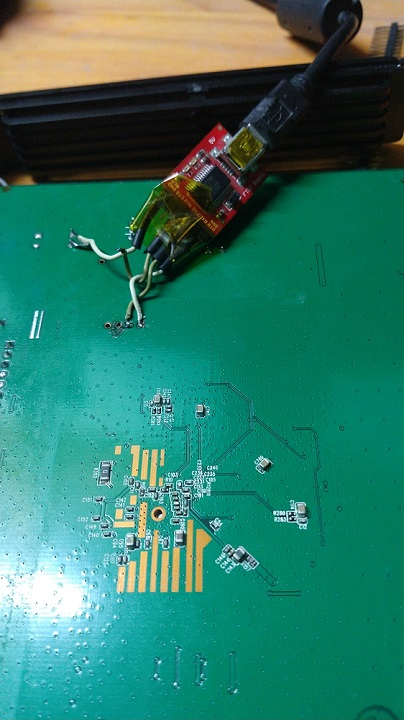

# Recuperando un TPLINK TL-WR941ND(ES) Ver.5.1

* Conectar un adaptador RS232 a USB 

  

  A la izquierda está el pin de TX (a RX del FTDI), le sigue RX y GND. Soldar GND en la pata de otro componente porque es un plano de masa que cuesta soldar si no se precalienta.

* Conectar a 115200 baudios y opciones por defecto

* si el router está en bootloop teclear tpl cuando muestra el mensaje booting

*  se obtiene un shell: wasp>

  * escribir printenv

  ````
  wasp> printenv
  bootargs=console=ttyS0,115200 root=31:02 rootfstype=jffs2 init=/sbin/init mtdparts=ath-nor0:128k(u-boot),1024k(kernel),2816k(rootfs),64k(config),64k(art)
  bootcmd=bootm 0x9f020000
  bootdelay=1
  baudrate=115200
  ethaddr=0xba:0xbe:0xfa:0xce:0x08:0x41
  ipaddr=192.168.1.111
  serverip=192.168.1.100
  dir=
  lu=tftp 0x81000000 ${dir}u-boot.bin&&erase 0x9f000000 +$filesize&&cp.b $fileaddr 0x9f000000 $filesize
  lf=tftp 0x81000000 ${dir}${bc}-squashfs&&erase 0x9f120000 +$filesize&&cp.b $fileaddr 0x9f120000 $filesize
  stdin=serial
  stdout=serial
  stderr=serial
  ethact=eth0
  ````

  * si se escribe tftpboot sin argumentos

    ````
    wasp> tftpboot
    *** Warning: no boot file name; using '6F01A8C0.img'
    Using eth1 device
    TFTP from server 192.168.1.100; our IP address is 192.168.1.111
    Filename '6F01A8C0.img'.
    Load address: 0x81000000
    ````

    Podemos ver que la ip por defecto del servidor es 192.168.1.100 y el router se asigna la ip 192.168.1.111, la direccion por defecto es 0x81000000 y el fichero es 6F01A8C0.img

  * Se puede cambiar la ip del dispositivo escribiendo ``setenv ipaddr=192.168.1.x`` y del servidor con ``setenv serverip=192.168.1.x``

  * conectar el router en el puerto 1 a la pc por ethernet

  * configurar la ip de la pc a ``serverip`` elegido

  * descargar el firmware https://static.tp-link.com/resources/software/TL-WR841N_V8_120522.zip y extraerlo en C:\temp

  * renombrar el binario a 6F01A8C0.img

  * instalar tftpd 64 bits en windows y configurar para que la interfaz sea la placa de red y el directorio sea C:\temp

  * ejecutar 

  * ````
    tftpboot 0x80000000
    erase 0x9f020000 +0x3c0000
    cp.b 0x80000000 0x9f020000 0x3c0000
    bootm 0x9f020000
    ````

Cuando el firmware es muy grande:

````
## Booting image at 9f020000 ...
   Uncompressing Kernel Image ... Too big uncompressed streamLZMA ERROR 1 - must                                  RESET board to recover
````

En la tty se puede ver el proceso de booteo

````
wasp> bootm 0x9f020000
## Booting image at 9f020000 ...
   Uncompressing Kernel Image ... OK

Starting kernel ...

Booting Atheros AR934x
Linux version 2.6.31--LSDK-9.2.0_U5.508 (root@localhost.localdomain) (gcc version 4.3.3 (GCC) ) #3 Thu Apr 12 09:57:51 CST 2012
flash_size passed from bootloader = 4
Ram size passed from bootloader =33554432
CPU revision is: 0001974c (MIPS 74Kc)
ath_sys_frequency: cpu srif ddr srif cpu 535 ddr 400 ahb 200
Determined physical RAM map:
 memory: 02000000 @ 00000000 (usable)
Zone PFN ranges:
  Normal   0x00000000 -> 0x00002000
Movable zone start PFN for each node
early_node_map[1] active PFN ranges
    0: 0x00000000 -> 0x00002000
Built 1 zonelists in Zone order, mobility grouping on.  Total pages: 8128
Kernel command line: console=ttyS0,115200 root=31:2 rootfstype=squashfs init=/sbin/init mtdparts=ath-nor0:128k(u-boot),1024k(kernel),2816k(rootfs),64k(config),64k(art) mem=32M
PID hash table entries: 128 (order: 7, 512 bytes)
Dentry cache hash table entries: 4096 (order: 2, 16384 bytes)
Inode-cache hash table entries: 2048 (order: 1, 8192 bytes)
Primary instruction cache 64kB, VIPT, 4-way, linesize 32 bytes.
Primary data cache 32kB, 4-way, VIPT, cache aliases, linesize 32 bytes
Writing ErrCtl register=00000000
Readback ErrCtl register=00000000
Memory: 30132k/32768k available (1722k kernel code, 2636k reserved, 426k data, 112k init, 0k highmem)
NR_IRQS:128
plat_time_init: plat time init done
Calibrating delay loop... 267.26 BogoMIPS (lpj=534528)
Mount-cache hash table entries: 512
NET: Registered protocol family 16
bio: create slab <bio-0> at 0
usbcore: registered new interface driver usbfs
usbcore: registered new interface driver hub
usbcore: registered new device driver usb
NET: Registered protocol family 2
IP route cache hash table entries: 1024 (order: 0, 4096 bytes)
TCP established hash table entries: 1024 (order: 1, 8192 bytes)
TCP bind hash table entries: 1024 (order: 0, 4096 bytes)
TCP: Hash tables configured (established 1024 bind 1024)
TCP reno registered
NET: Registered protocol family 1
ATH GPIOC major 0
squashfs: version 4.0 (2009/01/31) Phillip Lougher
msgmni has been set to 58
io scheduler noop registered
io scheduler deadline registered (default)
Serial: 8250/16550 driver, 1 ports, IRQ sharing disabled
serial8250.0: ttyS0 at MMIO 0xb8020000 (irq = 19) is a 16550A
console [ttyS0] enabled
PPP generic driver version 2.4.2
NET: Registered protocol family 24
5 cmdlinepart partitions found on MTD device ath-nor0
Creating 5 MTD partitions on "ath-nor0":
0x000000000000-0x000000020000 : "u-boot"
0x000000020000-0x000000120000 : "kernel"
0x000000120000-0x0000003e0000 : "rootfs"
0x0000003e0000-0x0000003f0000 : "config"
0x0000003f0000-0x000000400000 : "art"
->Oops: flash id 0xef4016 .
ehci_hcd: USB 2.0 'Enhanced' Host Controller (EHCI) Driver
Port Status 1c000004
ath-ehci ath-ehci.0: ATH EHCI
ath-ehci ath-ehci.0: new USB bus registered, assigned bus number 1
ehci_reset Intialize USB CONTROLLER in host mode: 13
ehci_reset Port Status 1c000000
ath-ehci ath-ehci.0: irq 3, io mem 0x1b000000
ehci_reset Intialize USB CONTROLLER in host mode: 13
ehci_reset Port Status 1c000000
ath-ehci ath-ehci.0: USB 2.0 started, EHCI 1.00
usb usb1: configuration #1 chosen from 1 choice
hub 1-0:1.0: USB hub found
hub 1-0:1.0: 1 port detected
TCP cubic registered
NET: Registered protocol family 17
802.1Q VLAN Support v1.8 Ben Greear <greearb@candelatech.com>
All bugs added by David S. Miller <davem@redhat.com>
athwdt_init: Registering WDT success
ath_otp_init: Registering OTP success
ath_clksw_init: Registering Clock Switch Interface success
VFS: Mounted root (squashfs filesystem) readonly on device 31:2.
Freeing unused kernel memory: 112k freed
usb 1-1: new full speed USB device using ath-ehci and address 2
usb 1-1: device descriptor read/64, error -71
usb 1-1: device descriptor read/64, error -71
init started:  BusyBox v1.01 (2012.04.13-11:59+0000) multi-call binary
usb 1-1: new full speed USB device using ath-ehci and address 3
This Board use 2.6.31
usb 1-1: device descriptor read/64, error -71
xt_time: kernel timezone is -0000
usb 1-1: device descriptor read/64, error -71
nf_conntrack version 0.5.0 (512 buckets, 5120 max)
usb 1-1: new full speed USB device using ath-ehci and address 4
usb 1-1: device not accepting address 4, error -71
ip_tables: (C) 2000-2006 Netfilter Core Team
insmod: cannot open module `/lib/modules/2.6.31/kernel/iptable_raw.ko': No such file or directory
usb 1-1: new full speed USB device using ath-ehci and address 5
insmod: cannot open module `/lib/modules/2.6.31/kernel/flashid.ko': No such file or directory
usb 1-1: device not accepting address 5, error -71
hub 1-0:1.0: unable to enumerate USB device on port 1
PPPoL2TP kernel driver, V1.0
PPTP driver version 0.8.3
insmod: cannot open module `/lib/modules/2.6.31/kernel/harmony.ko': No such file or directory

Now flash open!
Now flash open!
Now flash open!
Now flash open!
Now flash open!
Now flash open!
Now flash open!
Now flash open!
Now flash open!
Now flash open!
Now flash open!
Now flash open!
Erase from 0X3E0000 to 0X3EC7D4:.
Program from 0X3E0000 to 0X3EC7D4:
write successfully
 (none) mips #3 Thu Apr 12 09:57:51 CST 2012 (none)
(none) login: ATHR_GMAC: Length per segment 1536
ATHR_GMAC: fifo cfg 3 01f00140
ATHR_GMAC: RX TASKLET - Pkts per Intr:32
mac:1 Registering S27....
ATHR_GMAC: Max segments per packet :   1
ATHR_GMAC: Max tx descriptor count :   40
ATHR_GMAC: Max rx descriptor count :   128
ATHR_GMAC: Mac capability flags    :   2D82
ATHR_GMAC: RX TASKLET - Pkts per Intr:32
mac:0 Registering S27....
ATHR_GMAC: Max segments per packet :   1
ATHR_GMAC: Max tx descriptor count :   40
ATHR_GMAC: Max rx descriptor count :   128
ATHR_GMAC: Mac capability flags    :   2582
athr_gmac_ring_alloc Allocated 640 at 0x81e8fc00
athr_gmac_ring_alloc Allocated 2048 at 0x81ccb000
WASP ----> S27 PHY MDIO
Setting Drop CRC Errors, Pause Frames and Length Error frames
Setting PHY...
athr_gmac_ring_alloc Allocated 640 at 0x81e8f800
athr_gmac_ring_alloc Allocated 2048 at 0x81e95800
WASP ----> S27 PHY MDIO
Setting Drop CRC Errors, Pause Frames and Length Error frames
ATHRS27: resetting s27
ATHRS27: s27 reset done
++++ athrs27_igmp_setup once
port0 vid is 0xb000b
port1 vid is 0x30003
port2 vid is 0x50005
port3 vid is 0x70007
port4 vid is 0x90009
++ PVID: 0x0000000b, bitmap: 0x0000001f
++ PVID: 0x00000003, bitmap: 0x0000001f
++ PVID: 0x00000005, bitmap: 0x0000001f
++ PVID: 0x00000007, bitmap: 0x0000001f
++ PVID: 0x00000009, bitmap: 0x0000001f
vtable vid: 0x00000002, bitmap 0x00000003
vtable vid: 0x00000004, bitmap 0x00000005
vtable vid: 0x00000006, bitmap 0x00000007
vtable vid: 0x00000008, bitmap 0x00000009
vtable vid: 0x0000000a, bitmap 0x0000000b
vtable vid: 0x0000000c, bitmap 0x0000000d
vtable vid: 0x0000000e, bitmap 0x0000000f
vtable vid: 0x00000010, bitmap 0x00000011
vtable vid: 0x00000012, bitmap 0x00000013
vtable vid: 0x00000014, bitmap 0x00000015
vtable vid: 0x00000016, bitmap 0x00000017
vtable vid: 0x00000018, bitmap 0x00000019
vtable vid: 0x0000001a, bitmap 0x0000001b
vtable vid: 0x0000001c, bitmap 0x0000001d
vtable vid: 0x0000001e, bitmap 0x0000001f
vtable vid: 0x00000020, bitmap 0x00000021
Setting PHY...
device eth0 entered promiscuous mode
athr_gmac_ring_free Freeing at 0x81e8fc00
athr_gmac_ring_free Freeing at 0x81ccb000
athr_gmac_ring_alloc Allocated 640 at 0x81e8fc00
athr_gmac_ring_alloc Allocated 2048 at 0x81e91800
WASP ----> S27 PHY MDIO
Setting Drop CRC Errors, Pause Frames and Length Error frames
Setting PHY...
Now flash open!
athr_gmac_ring_free Freeing at 0x81e8f800
athr_gmac_ring_free Freeing at 0x81e95800
athr_gmac_ring_alloc Allocated 640 at 0x81e8f800
athr_gmac_ring_alloc Allocated 2048 at 0x81e95000
WASP ----> S27 PHY MDIO
Setting Drop CRC Errors, Pause Frames and Length Error frames
Setting PHY...
enet1 port1 up
ATHR_GMAC: Enet Unit:1 PHY:1 is UP RGMii 100Mbps full duplex
ATHR_GMAC: done cfg2 0x7215 ifctl 0x0 miictrl
WASP ----> S27 PHY MDIO
Setting Drop CRC Errors, Pause Frames and Length Error frames
br0: port 1(eth0) entering forwarding state
====>>>>DHCP start.dhcpc.c,dhcpcStart,396
====>>>>DHCP end.dhcpc.c,dhcpcStart,456
nf_conntrack_rtsp v0.6.21 loading
nf_nat_rtsp v0.6.21 loading
asf: module license 'Proprietary' taints kernel.
Disabling lock debugging due to kernel taint
ath_hal: 0.9.17.1 (AR5416, AR9380, REGOPS_FUNC, WRITE_EEPROM, 11D)
ath_rate_atheros: Copyright (c) 2001-2005 Atheros Communications, Inc, All Rights Reserved
ath_dev: Copyright (c) 2001-2007 Atheros Communications, Inc, All Rights Reserved
ath_ahb: 9.2.0_U10.1020 (Atheros/multi-bss)
__ath_attach: Set global_scn[0]
ACBKMinfree = 48
ACBEMinfree = 32
ACVIMinfree = 16
ACVOMinfree = 0
CABMinfree = 48
UAPSDMinfree = 0
Restoring Cal data from Flash
ath_get_caps[5105] rx chainmask mismatch actual 3 sc_chainmak 0
ath_get_caps[5080] tx chainmask mismatch actual 3 sc_chainmak 0
wifi0: Atheros 9340: mem=0xb8100000, irq=2
====>>>>SystemMode : Normal Router
wlan_vap_create : enter. devhandle=0x80d502c0, opmode=IEEE80211_M_HOSTAP, flags=0x1
wlan_vap_create : exit. devhandle=0x80d502c0, opmode=IEEE80211_M_HOSTAP, flags=0x1.
VAP device ath0 created
====>>>>wlan: rand channel 8


 DES SSID SET=TP-LINK_BEE888
 ieee80211_ioctl_siwmode: imr.ifm_active=131712, new mode=3, valid=1
 Free buffer count 256

sc_txq[0] :
sc_txq[0] : depth  is 0
 aggr_depth is 0 tidBufCount 0  bufQCount 0 axq_cnt 0

sc_txq[1] :
sc_txq[1] : depth  is 0
 aggr_depth is 0 tidBufCount 0  bufQCount 0 axq_cnt 0

sc_txq[2] :
sc_txq[2] : depth  is 0
 aggr_depth is 0 tidBufCount 0  bufQCount 0 axq_cnt 0

sc_txq[3] :
sc_txq[3] : depth  is 0
 aggr_depth is 0 tidBufCount 0  bufQCount 0 axq_cnt 0

sc_txq[6] :
sc_txq[6] : depth  is 0
 aggr_depth is 0 tidBufCount 0  bufQCount 0 axq_cnt 0

sc_txq[7] :
sc_txq[7] : depth  is 0
 aggr_depth is 0 tidBufCount 0  bufQCount 0 axq_cnt 0

sc_txq[8] :
sc_txq[8] : depth  is 0
 aggr_depth is 0 tidBufCount 0  bufQCount 0 axq_cnt 0


 ***********************************
athr_gmac_ring_free Freeing at 0x81e8f800
athr_gmac_ring_free Freeing at 0x81e95000
br0: port 1(eth0) entering disabled state
athr_gmac_ring_alloc Allocated 640 at 0x81e8f800
athr_gmac_ring_alloc Allocated 2048 at 0x81ef7800
WASP ----> S27 PHY MDIO
Setting Drop CRC Errors, Pause Frames and Length Error frames
Setting PHY...
 Free buffer count 256

sc_txq[0] :
sc_txq[0] : depth  is 0
 aggr_depth is 0 tidBufCount 0  bufQCount 0 axq_cnt 0

sc_txq[1] :
sc_txq[1] : depth  is 0
 aggr_depth is 0 tidBufCount 0  bufQCount 0 axq_cnt 0

sc_txq[2] :
sc_txq[2] : depth  is 0
 aggr_depth is 0 tidBufCount 0  bufQCount 0 axq_cnt 0

sc_txq[3] :
sc_txq[3] : depth  is 0
 aggr_depth is 0 tidBufCount 0  bufQCount 0 axq_cnt 0

sc_txq[6] :
sc_txq[6] : depth  is 0
 aggr_depth is 0 tidBufCount 0  bufQCount 0 axq_cnt 0

sc_txq[7] :
sc_txq[7] : depth  is 0
 aggr_depth is 0 tidBufCount 0  bufQCount 0 axq_cnt 0

sc_txq[8] :
sc_txq[8] : depth  is 0
 aggr_depth is 0 tidBufCount 0  bufQCount 0 axq_cnt 0


 ***********************************
device ath0 entered promiscuous mode
br0: port 2(ath0) entering forwarding state
 ieee80211_ioctl_siwmode: imr.ifm_active=1442432, new mode=3, valid=1
br0: port 2(ath0) entering disabled state

 DES SSID SET=TP-LINK_BEE888
 Free buffer count 256

sc_txq[0] :
sc_txq[0] : depth  is 0
 aggr_depth is 0 tidBufCount 0  bufQCount 0 axq_cnt 0

sc_txq[1] :
sc_txq[1] : depth  is 0
 aggr_depth is 0 tidBufCount 0  bufQCount 0 axq_cnt 0

sc_txq[2] :
sc_txq[2] : depth  is 0
 aggr_depth is 0 tidBufCount 0  bufQCount 0 axq_cnt 0

sc_txq[3] :
sc_txq[3] : depth  is 0
 aggr_depth is 0 tidBufCount 0  bufQCount 0 axq_cnt 0

sc_txq[6] :
sc_txq[6] : depth  is 0
 aggr_depth is 0 tidBufCount 0  bufQCount 0 axq_cnt 0

sc_txq[7] :
sc_txq[7] : depth  is 0
 aggr_depth is 0 tidBufCount 0  bufQCount 0 axq_cnt 0

sc_txq[8] :
sc_txq[8] : depth  is 0
 aggr_depth is 0 tidBufCount 0  bufQCount 0 axq_cnt 0


 ***********************************
br0: port 2(ath0) entering forwarding state
enet1 port1 up
ATHR_GMAC: Enet Unit:1 PHY:1 is UP RGMii 100Mbps full duplex
ATHR_GMAC: done cfg2 0x7215 ifctl 0x0 miictrl
WASP ----> S27 PHY MDIO
Setting Drop CRC Errors, Pause Frames and Length Error frames
br0: port 1(eth0) entering forwarding state
====>>>>cmdCtrl open success
====>>>>eventCtrl open success
====>>>>eventCtrl attach success
ATHR_GMAC: GE0 RX DMA ENABLE
ath_paprd_cal PAPRD excessive failure disabling PAPRD now

 TL-WR841N mips #3 Thu Apr 12 09:57:51 CST 2012 (none)
````

Ahora el router es un 841ND, para grabar el firmware del 941ND descargarlo de

https://static.tp-link.com/res/down/soft/TL-WR941ND_V5_150311.zip

Si intentamos subir este binario al router veremos que su tamaño es de ``0x3e02000`` y el firmware deberia tener ``0x3c0000``, entonces hay que cortar ``0x20200`` bytes. En decimal son 131584 que es igual a 257 bloques de 512 bytes.

abrir git bash y usar dd para remover el bootloader:

``dd if=orig.bin of=tplink.bin skip=257 bs=512``

ahora el archivo tplink.bin tiene un tamaño de ``0x3c0000`` y puede ser grabado al router siguiendo el procedimiento anterior.

## Referencias

https://scheissitwiekannichhelfen.wordpress.com/2018/12/17/tp-link-tl-wr941nd-unbrick-via-serial-interface/

https://forum.dd-wrt.com/phpBB2/viewtopic.php?t=313380&sid=8645ce8b5b4a50e34a49f05b98d83e4f
